# Quick Start: Terraform + Selefra, add data persistence and SQL query capabilities to your Provider

# Pre-requirements:

- Have a GitHub account and be able to create warehouse hosting code
- Installed git, can clone code from GitHub to localhost disk 
- Go SDK version >=1.19, understand the Go language, and can understand the sample code
- Mac or Linux system, able to execute Makefile
- wget has been installed, and files can be downloaded through the wget command
- Understand the basic concepts related to relational databases (databases, tables, etc.), Postgresql installation version >=13
- Have a Microsoft Cloud account, have installed the command line [az](https://learn.microsoft.com/zh-cn/cli/azure/) tool of Microsoft Cloud and successfully logged in and have container resource 

# Step 1: Create a warehouse

The recommended code management method is a Provider and a separate warehouse hosting code. We provide a Provider template warehouse on GitHub: https://github.com/selefra/selefra-provider-template, first create this warehouse as a template Your own Provider repository:

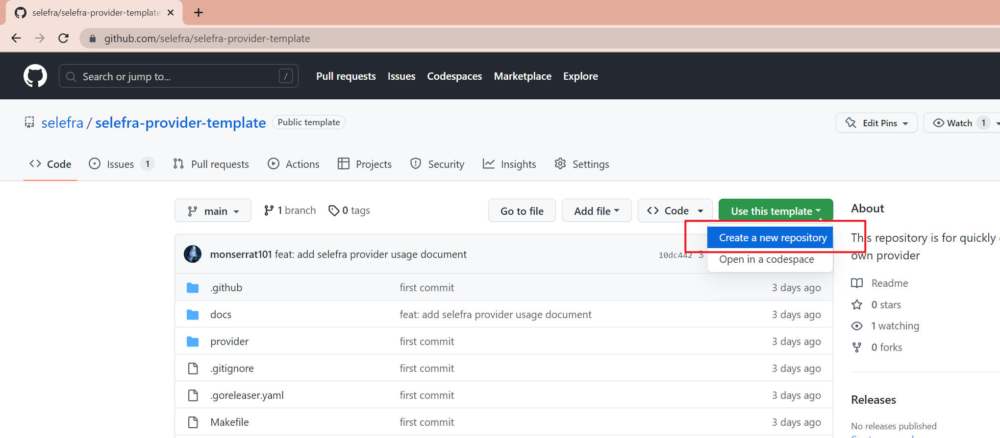

According to your own situation, select the organization or user under which the warehouse will be linked in 1 in the figure below, and enter the name of the warehouse in 2:

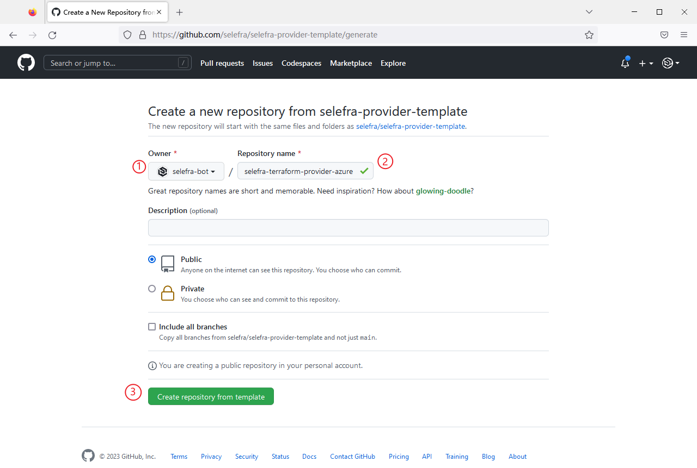

The recommended format for a repository name is:

```
selefra-terraform-provider-${name}
```

for example:

```
selefra-terraform-provider-azure
```

After setting the name, click Create repository from template at 3 places. It takes a few seconds to create the repository. After waiting for a while, it will automatically refresh and jump to the created repository:

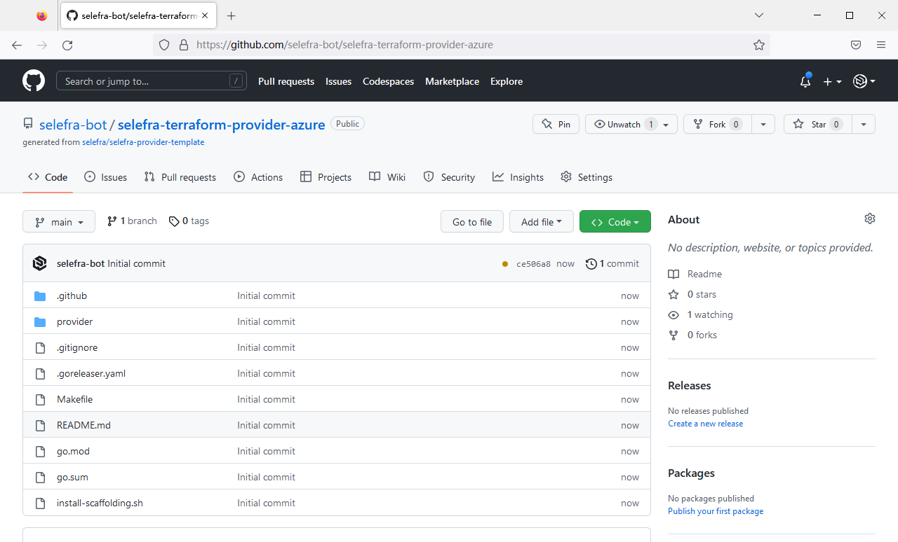

# Step 2: Initialize the project

Clone the repository locally:

```
git clone https://github.com/selefra-bot/selefra-terraform-provider-azure.git
```

Change into the directory of the project you just cloned:

```
cd selefra-terraform-provider-azure
```

We provide a scaffolding tool that exposes several commands in the form of Makefile. These commands run through the entire Provider development cycle to improve your development efficiency. The first is the make init command, which is used to initialize your project. , which accepts several parameters. Here we adopt the minimum configuration for the convenience of demonstration. We only need to set an environment variable and tell it the URL of the GitHub repository of the Terraform Provider corresponding to our repository:

```
export TERRAFORM_PROVIDER_URL=https://github.com/hashicorp/terraform-provider-azurerm
```

Then execute the initialization command:

```
make init
```

Example output:

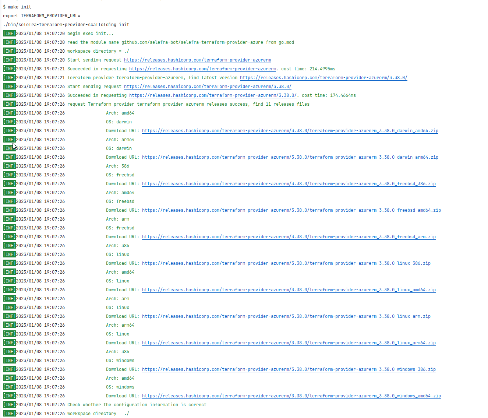

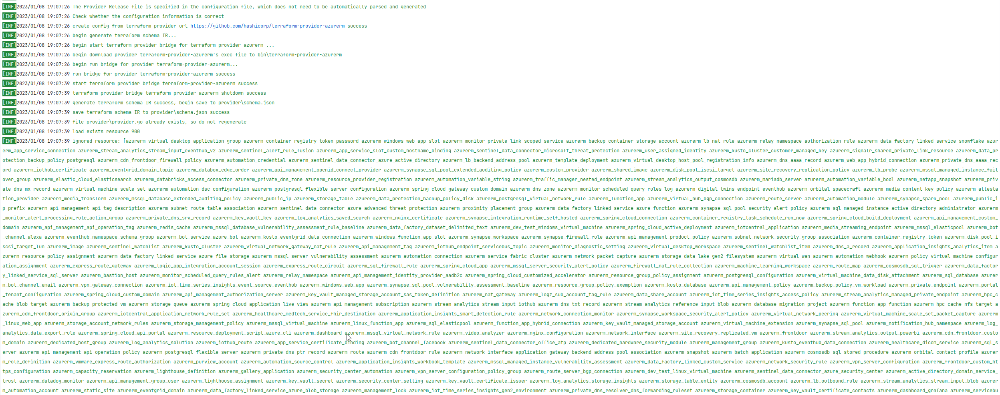

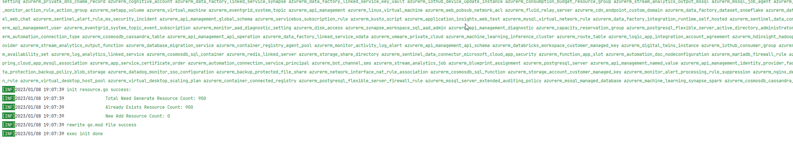

When you see the green font at the end and exit successfully, it means that the initialization is successful. If there is an unfortunate error, please refer to the FAQ section to contact us for technical support.
Then install project-related dependencies:

```
go mod tidy
```

Example output:

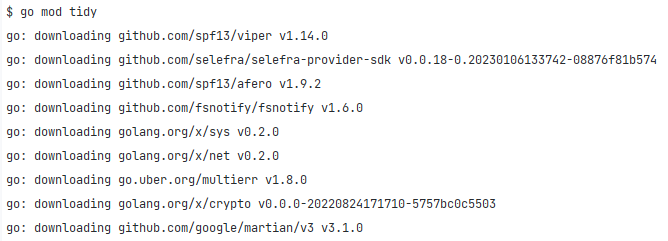

Let us introduce the two important tasks that you need to pay attention to that are automatically completed during the initialization phase. First, modify the name of the project module in go.mod to be correct. This is automatically inferred based on your GitHub warehouse URL, so you You don't have to modify it manually:

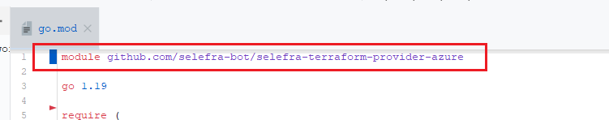

Then there are three more files in the provider directory of the project:

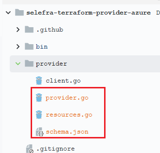

First let's look at the provider.go file:

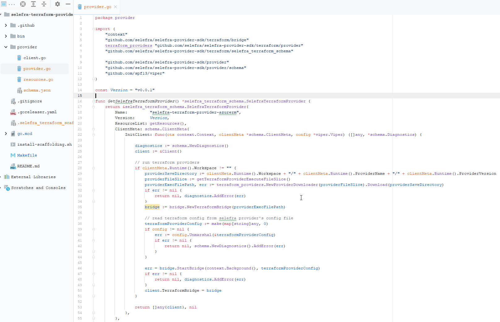

This file contains some automatically generated Provider-related information, including the Provider name, version, initialization logic, download information of the Release file of the Terraform Provider associated to it, and so on.
Then there is the resources.go file, each Resource in Terraform will generate a corresponding GetResource_${ResourceName} method:

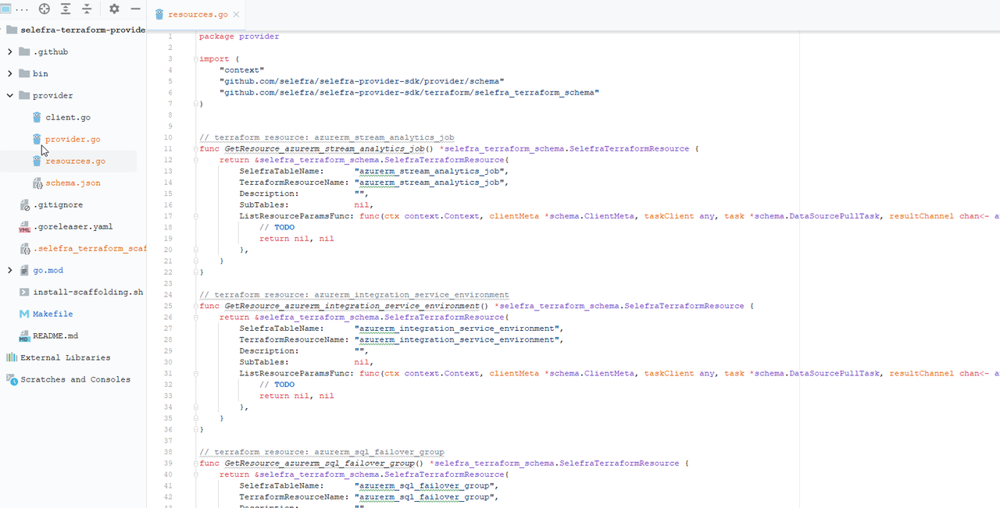

Let's take Resource azurerm_storage_container as an example:

```go
// terraform resource: azurerm_storage_container
func GetResource_azurerm_storage_container() *selefra_terraform_schema.SelefraTerraformResource {
   return &selefra_terraform_schema.SelefraTerraformResource{
      SelefraTableName:      "azurerm_storage_container",
      TerraformResourceName: "azurerm_storage_container",
      Description:           "",
      SubTables:             nil,
      ListResourceParamsFunc: func(ctx context.Context, clientMeta *schema.ClientMeta, taskClient any, task *schema.DataSourcePullTask, resultChannel chan<- any) ([]*selefra_terraform_schema.ResourceRequestParam, *schema.Diagnostics) {
         // TODO
         return nil, nil
      },
   }
}
```

- TerraformResourceName and SelefraTableName represent the corresponding relationship between Terraform's Resource access and Selefra's table name, just keep the default
- Description, you can write some table description information here, just keep the default
- SubTables do not need to be modified, just keep the default

The concept of sub-tables is only briefly introduced here, because sub-tables are not necessary. This concept will only be involved when the data model of your Provider is more complicated. The tables in Selefra's Provider are tree-shaped Association relationship (if there is no association relationship, it is considered a tree with only the root node). For example, the information of the bucket corresponds to a table aws_s3_buckets, the authorization information of the bucket corresponds to a table aws_s3_bucket_grants, and the CORS rule of the bucket corresponds to a table aws_s3_bucket_cors_rules, tables aws_s3_bucket_grants and aws_s3_bucket_cors_rules will have a logical foreign key bucket_name associated with aws_s3_buckets, and they form a tree relationship:

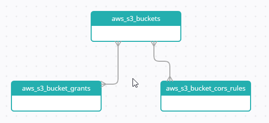

For more details, please move to our documentation: https://www.selefra.io/docs/introduction/

- ListResourceParamsFunc is the key to connecting your Terraform Provider to Selefra, and it is also the part that needs to be implemented by your code. The ListResourceParamsFunc function needs to return a slice of ResourceRequestParam type. ResourceRequestParam tells Selefra how to request a Terraform Resource:

  ```go
  // ResourceRequestParam Request parameters for the resource
  type ResourceRequestParam struct {
  
     // ID of resource
     ID string
  
     // The parameters required to request the resource
     ArgumentMap map[string]any
  }
  ```

For resources that only need an ID to uniquely identify a resource, just set an ID field, such as AWS’s aws_s3_bucket, set the name of the bucket to the ID field and return it, and Selefra can pull back the corresponding bucket information and store it in Postgresql For example, for the azurerm_storage_container of azurerm, you need to set name and storage_account_name, because these two are required parameters:

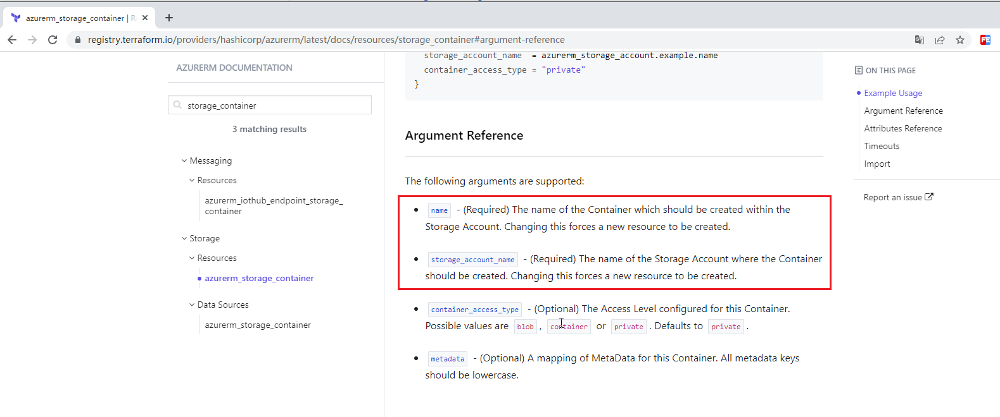

For this kind of thing, just put it in the ArgumentMap of ResourceRequestParam. It may not be easy to understand. It doesn't matter. The next part will actually write a ListResourceParamsFunc for the concept just introduced.
Oh, I almost forgot, schema.json is the stored Terraform Resource Schema information, which is a cache file, unless the Schema of the Terraform Provider to be accessed has changed and needs to be deleted and re-make init, generally ignore it:

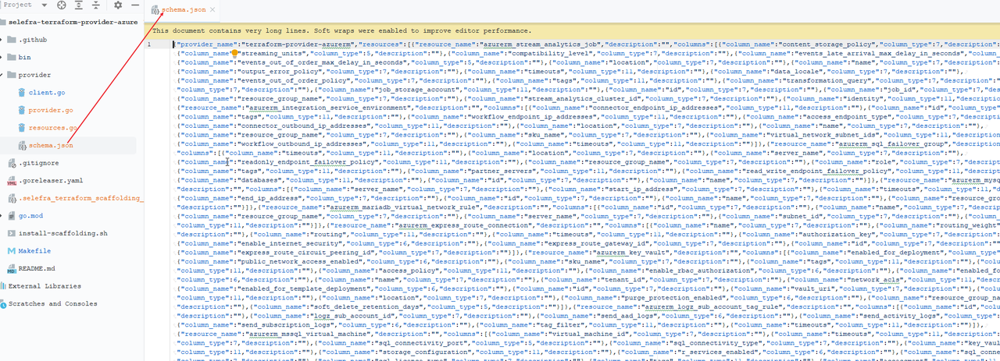

# Step 3: Coding: Write the code for the resource List method

Although this step is mainly coding-related work, in order to save time, readers only need to copy and paste the code given by the author.

## 3.1 go.mod add dependencies

First of all, we need to add the relevant dependencies of the Microsoft Cloud SDK. For convenience, I directly paste my go.mod here. Readers can just copy and paste it. Note that the first line of module should keep using your own original module name and do not overwrite it. , because this one is different for everyone:

```
module github.com/selefra-bot/selefra-terraform-provider-azure

go 1.19

require (
   github.com/Azure/azure-sdk-for-go v57.0.0+incompatible
   github.com/Azure/go-autorest/autorest v0.11.20
   github.com/Azure/go-autorest/autorest/azure/auth v0.5.8
   github.com/selefra/selefra-provider-sdk v0.0.18-0.20230106133742-08876f81b574
   github.com/spf13/viper v1.14.0
)

require (
   cloud.google.com/go v0.107.0 // indirect
   cloud.google.com/go/compute v1.12.1 // indirect
   cloud.google.com/go/compute/metadata v0.2.1 // indirect
   cloud.google.com/go/iam v0.7.0 // indirect
   cloud.google.com/go/storage v1.28.0 // indirect
   github.com/Azure/go-autorest v14.2.0+incompatible // indirect
   github.com/Azure/go-autorest/autorest/adal v0.9.15 // indirect
   github.com/Azure/go-autorest/autorest/azure/cli v0.4.3 // indirect
   github.com/Azure/go-autorest/autorest/date v0.3.0 // indirect
   github.com/Azure/go-autorest/autorest/to v0.4.0 // indirect
   github.com/Azure/go-autorest/autorest/validation v0.3.1 // indirect
   github.com/Azure/go-autorest/logger v0.2.1 // indirect
   github.com/Azure/go-autorest/tracing v0.6.0 // indirect
   github.com/Masterminds/squirrel v1.5.3 // indirect
   github.com/aws/aws-sdk-go v1.44.149 // indirect
   github.com/bgentry/go-netrc v0.0.0-20140422174119-9fd32a8b3d3d // indirect
   github.com/dimchansky/utfbom v1.1.1 // indirect
   github.com/doug-martin/goqu/v9 v9.18.0 // indirect
   github.com/emirpasic/gods v1.18.1 // indirect
   github.com/fatih/color v1.13.0 // indirect
   github.com/fsnotify/fsnotify v1.6.0 // indirect
   github.com/golang-jwt/jwt/v4 v4.0.0 // indirect
   github.com/golang/glog v1.0.0 // indirect
   github.com/golang/groupcache v0.0.0-20210331224755-41bb18bfe9da // indirect
   github.com/golang/protobuf v1.5.2 // indirect
   github.com/google/go-cmp v0.5.9 // indirect
   github.com/google/uuid v1.3.0 // indirect
   github.com/googleapis/enterprise-certificate-proxy v0.2.0 // indirect
   github.com/googleapis/gax-go/v2 v2.7.0 // indirect
   github.com/hashicorp/errwrap v1.1.0 // indirect
   github.com/hashicorp/go-cleanhttp v0.5.2 // indirect
   github.com/hashicorp/go-cty v1.4.1-0.20200414143053-d3edf31b6320 // indirect
   github.com/hashicorp/go-getter v1.6.2 // indirect
   github.com/hashicorp/go-hclog v1.3.1 // indirect
   github.com/hashicorp/go-multierror v1.1.1 // indirect
   github.com/hashicorp/go-plugin v1.4.6 // indirect
   github.com/hashicorp/go-safetemp v1.0.0 // indirect
   github.com/hashicorp/go-version v1.6.0 // indirect
   github.com/hashicorp/hcl v1.0.0 // indirect
   github.com/hashicorp/yamux v0.1.1 // indirect
   github.com/jackc/chunkreader/v2 v2.0.1 // indirect
   github.com/jackc/pgconn v1.13.0 // indirect
   github.com/jackc/pgio v1.0.0 // indirect
   github.com/jackc/pgpassfile v1.0.0 // indirect
   github.com/jackc/pgproto3/v2 v2.3.1 // indirect
   github.com/jackc/pgservicefile v0.0.0-20200714003250-2b9c44734f2b // indirect
   github.com/jackc/pgtype v1.12.0 // indirect
   github.com/jackc/pgx/v4 v4.17.2 // indirect
   github.com/jackc/puddle v1.3.0 // indirect
   github.com/jmespath/go-jmespath v0.4.0 // indirect
   github.com/klauspost/compress v1.15.12 // indirect
   github.com/lann/builder v0.0.0-20180802200727-47ae307949d0 // indirect
   github.com/lann/ps v0.0.0-20150810152359-62de8c46ede0 // indirect
   github.com/magiconair/properties v1.8.6 // indirect
   github.com/mattn/go-colorable v0.1.13 // indirect
   github.com/mattn/go-isatty v0.0.16 // indirect
   github.com/mitchellh/go-homedir v1.1.0 // indirect
   github.com/mitchellh/go-testing-interface v1.14.1 // indirect
   github.com/mitchellh/mapstructure v1.5.0 // indirect
   github.com/natefinch/lumberjack v2.0.0+incompatible // indirect
   github.com/oklog/run v1.1.0 // indirect
   github.com/pelletier/go-toml v1.9.5 // indirect
   github.com/pelletier/go-toml/v2 v2.0.5 // indirect
   github.com/pulumi/pulumi-terraform-bridge/v3 v3.31.0 // indirect
   github.com/pulumi/pulumi/sdk/v3 v3.42.0 // indirect
   github.com/satori/go.uuid v1.2.0 // indirect
   github.com/selefra/selefra-utils v0.0.2 // indirect
   github.com/songzhibin97/go-ognl v0.0.2 // indirect
   github.com/spf13/afero v1.9.2 // indirect
   github.com/spf13/cast v1.5.0 // indirect
   github.com/spf13/jwalterweatherman v1.1.0 // indirect
   github.com/spf13/pflag v1.0.5 // indirect
   github.com/subosito/gotenv v1.4.1 // indirect
   github.com/ulikunitz/xz v0.5.10 // indirect
   github.com/vmihailenco/msgpack v4.0.4+incompatible // indirect
   go.opencensus.io v0.24.0 // indirect
   go.uber.org/atomic v1.9.0 // indirect
   go.uber.org/multierr v1.8.0 // indirect
   go.uber.org/zap v1.23.0 // indirect
   golang.org/x/crypto v0.0.0-20220824171710-5757bc0c5503 // indirect
   golang.org/x/net v0.2.0 // indirect
   golang.org/x/oauth2 v0.2.0 // indirect
   golang.org/x/sys v0.2.0 // indirect
   golang.org/x/text v0.5.0 // indirect
   golang.org/x/xerrors v0.0.0-20220907171357-04be3eba64a2 // indirect
   google.golang.org/api v0.103.0 // indirect
   google.golang.org/appengine v1.6.7 // indirect
   google.golang.org/genproto v0.0.0-20221118155620-16455021b5e6 // indirect
   google.golang.org/grpc v1.51.0 // indirect
   google.golang.org/protobuf v1.28.1 // indirect
   gopkg.in/ini.v1 v1.67.0 // indirect
   gopkg.in/yaml.v2 v2.4.0 // indirect
   gopkg.in/yaml.v3 v3.0.1 // indirect
)
```

## 3.2 client.go perfection

Just copy and replace all the contents of client.go in the provider directory:

```go
package provider

import (
   "github.com/Azure/go-autorest/autorest"
   "github.com/Azure/go-autorest/autorest/azure/auth"
   "github.com/selefra/selefra-provider-sdk/provider/schema"
   "github.com/selefra/selefra-provider-sdk/terraform/bridge"
)

import (
   "context"
   "github.com/Azure/azure-sdk-for-go/services/subscription/mgmt/2020-09-01/subscription"
   _ "github.com/Azure/go-autorest/autorest"
)

type Client struct {
   TerraformBridge *bridge.TerraformBridge

   Authorizer             autorest.Authorizer
   Subscriptions          []string
   CurrentUseSubscription string

   // TODO You can continue to refine your client

}

func (x Client) CopyWithSubscription(subscriptionId string) *Client {
   return &Client{
      TerraformBridge:        x.TerraformBridge,
      Authorizer:             x.Authorizer,
      Subscriptions:          x.Subscriptions,
      CurrentUseSubscription: subscriptionId,
   }
}

func newClient(clientMeta *schema.ClientMeta) (*Client, error) {
   authorizer, subscriptions, err := getSubscriptions(clientMeta)
   if err != nil {
      ErrorF(clientMeta, "Failed to get subscription information: %s", err.Error())
      return nil, err
   }
   DebugF(clientMeta, "Obtaining subscription information successfully...")
   return &Client{
      Authorizer:    authorizer,
      Subscriptions: subscriptions,
   }, nil
}

func getSubscriptions(clientMeta *schema.ClientMeta) (autorest.Authorizer, []string, error) {
   azureAuth, err := auth.NewAuthorizerFromCLI()
   if err != nil {
      ErrorF(clientMeta, "Failed to obtain authentication from az cli: %s, trying to obtain authentication information from environment variables...", err.Error())
      azureAuth, err = auth.NewAuthorizerFromEnvironment()
   }
   if err != nil {
      ErrorF(clientMeta, "Obtaining auth information finally failed: %s", err.Error())
      return nil, nil, err
   }

   ctx := context.Background()
   svc := subscription.NewSubscriptionsClient()
   svc.Authorizer = azureAuth
   res, err := svc.List(ctx)
   if err != nil {
      ErrorF(clientMeta, "Failed to list subscriptions: %s", err.Error())
      return nil, nil, err
   }
   DebugF(clientMeta, "The list of subscriptions is successful, start to turn the page...")
   subscriptions := make([]string, 0)
   for res.NotDone() {
      for _, sub := range res.Values() {
         switch sub.State {
         case subscription.Disabled:
            DebugF(clientMeta, "subscription.Disabled, Not fetching from subscription because it is disabled subscription", *sub.SubscriptionID)
         case subscription.Deleted:
            DebugF(clientMeta, "subscription.Deleted, Not fetching from subscription because it is deleted subscription", *sub.SubscriptionID)
         default:
            subscriptions = append(subscriptions, *sub.SubscriptionID)
            DebugF(clientMeta, "Found an available subscription ID: %s", *sub.SubscriptionID)
         }
      }
      err := res.NextWithContext(ctx)
      if err != nil {
         ErrorF(clientMeta, "Page turning failed: %s", err.Error())
         return nil, nil, err
      }
   }
   DebugF(clientMeta, "Successfully obtained subscription: %s", subscriptions)
   return azureAuth, subscriptions, nil
}

func DebugF(clientMeta *schema.ClientMeta, msg string, args ...any) {
   if clientMeta != nil {
      clientMeta.DebugF(msg, args...)
   }
}

func ErrorF(clientMeta *schema.ClientMeta, msg string, args ...any) {
   if clientMeta != nil {
      clientMeta.ErrorF(msg, args...)
   }
}
```

## 3.3 provider.go

Replace the content of provider.go under the provider path:

```go
package provider

import (
   "context"
   "github.com/selefra/selefra-provider-sdk/terraform/bridge"
   terraform_providers "github.com/selefra/selefra-provider-sdk/terraform/provider"
   "github.com/selefra/selefra-provider-sdk/terraform/selefra_terraform_schema"

   "github.com/selefra/selefra-provider-sdk/provider"
   "github.com/selefra/selefra-provider-sdk/provider/schema"
   "github.com/spf13/viper"
)

const Version = "v0.0.1"

func GetSelefraTerraformProvider() *selefra_terraform_schema.SelefraTerraformProvider {
   return &selefra_terraform_schema.SelefraTerraformProvider{
      Name:         "selefra-terraform-provider-azurerm",
      Version:      Version,
      ResourceList: getResources(),
      ClientMeta: schema.ClientMeta{
         InitClient: func(ctx context.Context, clientMeta *schema.ClientMeta, config *viper.Viper) ([]any, *schema.Diagnostics) {

            clientMeta.Debug("Start initializing client...")

            diagnostics := schema.NewDiagnostics()
            client, err := newClient(clientMeta)
            if err != nil {
               clientMeta.Debug("Failed to create client...")
               return nil, schema.NewDiagnostics().AddError(err)
            }

            // run terraform providers
            if clientMeta.Runtime().Workspace != "" {
               providerSaveDirectory := clientMeta.Runtime().Workspace + "/" + clientMeta.Runtime().ProviderName + "/" + clientMeta.Runtime().ProviderVersion
               providerFileSlice := getTerraformProviderExecuteFileSlice()
               providerExecFilePath, err := terraform_providers.NewProviderDownloader(providerFileSlice).Download(providerSaveDirectory)
               if err != nil {
                  return nil, diagnostics.AddError(err)
               }
               bridge := bridge.NewTerraformBridge(providerExecFilePath)

               // read terraform config from selefra provider's config file
               terraformProviderConfig := make(map[string]any, 0)
               if config != nil {
                  err := config.Unmarshal(&terraformProviderConfig)
                  if err != nil {
                     return nil, schema.NewDiagnostics().AddError(err)
                  }
               }

               err = bridge.StartBridge(context.Background(), terraformProviderConfig)
               if err != nil {
                  return nil, diagnostics.AddError(err)
               }
               client.TerraformBridge = bridge
            }

            return []any{client}, nil
         },
      },
      ConfigMeta: provider.ConfigMeta{
         GetDefaultConfigTemplate: func(ctx context.Context) string {
            // TODO
            return ``
         },
         Validation: func(ctx context.Context, config *viper.Viper) *schema.Diagnostics {
            client, err := newClient(nil)
            if err != nil {
               return schema.NewDiagnostics().AddError(err)
            }
            if len(client.Subscriptions) == 0 {
               return schema.NewDiagnostics().AddErrorMsg("at least one subscription!")
            }
            return nil
         },
      },
      TransformerMeta: schema.TransformerMeta{
         DefaultColumnValueConvertorBlackList: []string{},
         DataSourcePullResultAutoExpand:       true,
      },
      ErrorsHandlerMeta: schema.ErrorsHandlerMeta{
         IgnoredErrors: []schema.IgnoredError{schema.IgnoredErrorOnSaveResult},
      },
   }
}

func getTerraformProviderExecuteFileSlice() []*terraform_providers.TerraformProviderFile {
   providerFileSlice := make([]*terraform_providers.TerraformProviderFile, 0)

   providerFileSlice = append(providerFileSlice, &terraform_providers.TerraformProviderFile{
      ProviderName:    "",
      ProviderVersion: "3.38.0",
      DownloadUrl:     "https://releases.hashicorp.com/terraform-provider-azurerm/3.38.0/terraform-provider-azurerm_3.38.0_darwin_amd64.zip",
      Arch:            "amd64",
      OS:              "darwin",
   })

   providerFileSlice = append(providerFileSlice, &terraform_providers.TerraformProviderFile{
      ProviderName:    "",
      ProviderVersion: "3.38.0",
      DownloadUrl:     "https://releases.hashicorp.com/terraform-provider-azurerm/3.38.0/terraform-provider-azurerm_3.38.0_darwin_arm64.zip",
      Arch:            "arm64",
      OS:              "darwin",
   })

   providerFileSlice = append(providerFileSlice, &terraform_providers.TerraformProviderFile{
      ProviderName:    "",
      ProviderVersion: "3.38.0",
      DownloadUrl:     "https://releases.hashicorp.com/terraform-provider-azurerm/3.38.0/terraform-provider-azurerm_3.38.0_freebsd_386.zip",
      Arch:            "386",
      OS:              "freebsd",
   })

   providerFileSlice = append(providerFileSlice, &terraform_providers.TerraformProviderFile{
      ProviderName:    "",
      ProviderVersion: "3.38.0",
      DownloadUrl:     "https://releases.hashicorp.com/terraform-provider-azurerm/3.38.0/terraform-provider-azurerm_3.38.0_freebsd_amd64.zip",
      Arch:            "amd64",
      OS:              "freebsd",
   })

   providerFileSlice = append(providerFileSlice, &terraform_providers.TerraformProviderFile{
      ProviderName:    "",
      ProviderVersion: "3.38.0",
      DownloadUrl:     "https://releases.hashicorp.com/terraform-provider-azurerm/3.38.0/terraform-provider-azurerm_3.38.0_freebsd_arm.zip",
      Arch:            "arm",
      OS:              "freebsd",
   })

   providerFileSlice = append(providerFileSlice, &terraform_providers.TerraformProviderFile{
      ProviderName:    "",
      ProviderVersion: "3.38.0",
      DownloadUrl:     "https://releases.hashicorp.com/terraform-provider-azurerm/3.38.0/terraform-provider-azurerm_3.38.0_linux_386.zip",
      Arch:            "386",
      OS:              "linux",
   })

   providerFileSlice = append(providerFileSlice, &terraform_providers.TerraformProviderFile{
      ProviderName:    "",
      ProviderVersion: "3.38.0",
      DownloadUrl:     "https://releases.hashicorp.com/terraform-provider-azurerm/3.38.0/terraform-provider-azurerm_3.38.0_linux_amd64.zip",
      Arch:            "amd64",
      OS:              "linux",
   })

   providerFileSlice = append(providerFileSlice, &terraform_providers.TerraformProviderFile{
      ProviderName:    "",
      ProviderVersion: "3.38.0",
      DownloadUrl:     "https://releases.hashicorp.com/terraform-provider-azurerm/3.38.0/terraform-provider-azurerm_3.38.0_linux_arm.zip",
      Arch:            "arm",
      OS:              "linux",
   })

   providerFileSlice = append(providerFileSlice, &terraform_providers.TerraformProviderFile{
      ProviderName:    "",
      ProviderVersion: "3.38.0",
      DownloadUrl:     "https://releases.hashicorp.com/terraform-provider-azurerm/3.38.0/terraform-provider-azurerm_3.38.0_linux_arm64.zip",
      Arch:            "arm64",
      OS:              "linux",
   })

   providerFileSlice = append(providerFileSlice, &terraform_providers.TerraformProviderFile{
      ProviderName:    "",
      ProviderVersion: "3.38.0",
      DownloadUrl:     "https://releases.hashicorp.com/terraform-provider-azurerm/3.38.0/terraform-provider-azurerm_3.38.0_windows_386.zip",
      Arch:            "386",
      OS:              "windows",
   })

   providerFileSlice = append(providerFileSlice, &terraform_providers.TerraformProviderFile{
      ProviderName:    "",
      ProviderVersion: "3.38.0",
      DownloadUrl:     "https://releases.hashicorp.com/terraform-provider-azurerm/3.38.0/terraform-provider-azurerm_3.38.0_windows_amd64.zip",
      Arch:            "amd64",
      OS:              "windows",
   })

   return providerFileSlice
}

func getResources() []*selefra_terraform_schema.SelefraTerraformResource {
   return []*selefra_terraform_schema.SelefraTerraformResource{
      // GetResource_example(),
   }
}
```

## 3.4 Write the ListIdsFunc code of azurerm_storage_container

Open resources.go in the provider directory, and import related packages at the beginning of the file:

```go

import (
   "context"
   "fmt"
   "github.com/Azure/azure-sdk-for-go/services/storage/mgmt/2021-01-01/storage"
   "github.com/selefra/selefra-provider-sdk/provider/schema"
   "github.com/selefra/selefra-provider-sdk/terraform/selefra_terraform_schema"
   "regexp"
   "strings"
)
```

Then replace the implementation of azurerm_storage_container:

```go

// ------------------------------------------------- --------------------------------------------------------------------

// terraform resource: azurerm_storage_container
func GetResource_azurerm_storage_container() *selefra_terraform_schema.SelefraTerraformResource {
   return &selefra_terraform_schema.SelefraTerraformResource{
      SelefraTableName:      "azurerm_storage_container",
      TerraformResourceName: "azurerm_storage_container",
      Description:           "",
      SubTables:             nil,
      ExpandClientTask: func(ctx context.Context, clientMeta *schema.ClientMeta, client any, task *schema.DataSourcePullTask) []*schema.ClientTaskContext {
         taskClient := client.(*Client)
         clientTaskContextSlice := make([]*schema.ClientTaskContext, 0)
         for _, sub := range client.(*Client).Subscriptions {
            clientTaskContextSlice = append(clientTaskContextSlice, &schema.ClientTaskContext{
               Task:   task,
               Client: taskClient.CopyWithSubscription(sub),
            })
         }
         return clientTaskContextSlice
      },
      ListResourceParamsFunc: func(ctx context.Context, clientMeta *schema.ClientMeta, taskClient any, task *schema.DataSourcePullTask, resultChannel chan<- any) ([]*selefra_terraform_schema.ResourceRequestParam, *schema.Diagnostics) {
         client := taskClient.(*Client)

         // step 1. collect all accounts
         accountSlice := make([]storage.Account, 0)
         accountClient := storage.NewAccountsClient(client.CurrentUseSubscription)
         accountClient.Authorizer = client.Authorizer
         accountListResponse, err := accountClient.List(ctx)
         if err != nil {
            return nil, schema.NewDiagnosticsErrorPullTable(task.Table, err)
         }
         for accountListResponse.NotDone() {
            accountSlice = append(accountSlice, accountListResponse.Values()...)
            if err := accountListResponse.NextWithContext(ctx); err != nil {
               return nil, schema.NewDiagnosticsErrorPullTable(task.Table, err)
            }
         }

         // step 2. collect contains id
         resourceRequestParamSlice := make([]*selefra_terraform_schema.ResourceRequestParam, 0)
         for _, account := range accountSlice {
            if !isBlobSupported(&account) {
               continue
            }
            if account.ID == nil {
               continue
            }
            resource, err := ParseResourceID(*account.ID)
            containersClient := storage.NewBlobContainersClient(client.CurrentUseSubscription)
            containersClient.Authorizer = client.Authorizer
            response, err := containersClient.List(ctx, resource.ResourceGroup, *account.Name, "", "", "")
            if err != nil {
               continue
            }
            for response.NotDone() {
               for _, item := range response.Values() {
                  if item.ID == nil {
                     continue
                  }
                  resourceID := fmt.Sprintf("https://%s.blob.core.windows.net/%s", *account.Name, *item.Name)
                  paramMap := make(map[string]any, 0)
                  paramMap["name"] = *item.Name
                  paramMap["storage_account_name"] = *account.Name
                  resourceRequestParamSlice = append(resourceRequestParamSlice, &selefra_terraform_schema.ResourceRequestParam{
                     ID:          resourceID,
                     ArgumentMap: paramMap,
                  })
               }
               if err := response.NextWithContext(ctx); err != nil {
                  return nil, schema.NewDiagnosticsErrorPullTable(task.Table, err)
               }
            }
         }

         return resourceRequestParamSlice, nil
      },
   }
}

type ResourceDetails struct {
   Subscription  string
   ResourceGroup string
   Provider      string
   ResourceType  string
   ResourceName  string
}

const resourceIDPatternText = `(?i)subscriptions/(.+)/resourceGroups/(.+)/providers/(.+?)/(.+?)/(.+)`

var resourceIDPattern = regexp.MustCompile(resourceIDPatternText)

func ParseResourceID(resourceID string) (ResourceDetails, error) {
   match := resourceIDPattern.FindStringSubmatch(resourceID)

   if len(match) == 0 {
      return ResourceDetails{}, fmt.Errorf("parsing failed for %s. Invalid resource Id format", resourceID)
   }

   v := strings.Split(match[5], "/")
   resourceName := v[len(v)-1]

   result := ResourceDetails{
      Subscription:  match[1],
      ResourceGroup: match[2],
      Provider:      match[3],
      ResourceType:  match[4],
      ResourceName:  resourceName,
   }

   return result, nil
}

func isBlobSupported(account *storage.Account) bool {
   return (account.Kind == storage.Storage) || (account.Kind == storage.StorageV2) ||
      (account.Kind == storage.BlockBlobStorage) || (account.Kind == storage.BlobStorage)
}

// ------------------------------------------------- --------------------------------------------------------------------
```

# Step 4: Test: configure test parameters and run

Note: To run the code, ensure that Microsoft Cloud's command-line tool az is installed and there are credentials for successful login locally, otherwise Terraform's Provider will fail to start.

## 4.1 Database connection

The unit test will execute the data pull process, but the pulled data needs to be saved in the postgresql database, and the database connection is configured through the environment variable SELEFRA_DATABASE_DSN. As an example, please modify the relevant parameters according to your own configuration:
export SELEFRA_DATABASE_DSN='host=127.0.0.1 user=postgres password=postgres port=5432 dbname=postgres sslmode=disable'

## 4.2 make test

Then set the name of the resource to be tested, if there are more than one, use English commas to separate:

```
export SELEFRA_TEST_TABLES=azurerm_storage_container
```

Then execute the test:

```
make test 
```

Wait for a while for the test case to finish running, then open the table, and find that the data has been pulled back. The author's test account has only one piece of data, because only one Container was created:

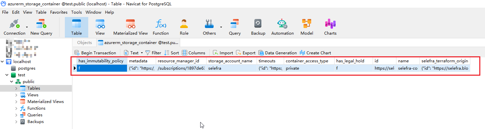

# FAQ: Frequently Asked Questions

## 1. What should I do if an error occurs during execution? How to provide technical support?

- You can join our slack for feedback questions: https://www.selefra.io/community/join
- You can submit issues feedback under our main warehouse, it is recommended to communicate in English: https://github.com/selefra/selefra/issues
- You can contact your account manager for a more real-time response

## 2. What should I do if the message "Selefra is not supported on your platform" is displayed? Is it available for Windows users?

If you are a Windows user, you may see the following error when executing make init:

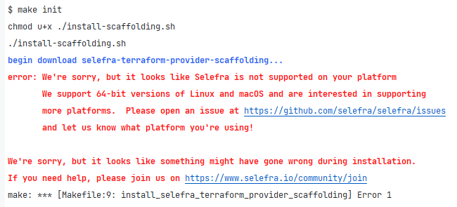

Currently there is no support plan for Windows users, if you are a Windows system and want to use our tools, please contact us to let us know that there is a need for Windows support.

## 3. Microsoft cloud authentication failed

If the following error is displayed in make test, please confirm that your Microsoft cloud login credentials are correct and the network is unblocked. The following example is an exception thrown when an invalid proxy is configured:

```
$ make test
export TERRAFORM_PROVIDER_URL=
./bin/selefra-terraform-provider-scaffolding generate
[INF]2023/01/09 12:17:30 begin run generate...
[INF]2023/01/09 12:17:30 begin read or generate terraform schema IR...
[INF]2023/01/09 12:17:30 read terraform schema IR error success
[ERR]2023/01/09 12:17:30 remove directory resources failed: remove resources\selefra-terraform-provider-azurerm\v0.0.1\3.38.0\terraform-provider-azurerm_v3.38.0_x5.exe: Access is denied.
[INF]2023/01/09 12:17:30 create directory resources success
[INF]2023/01/09 12:17:30 begin ast parse go file provider\client.go...
[INF]2023/01/09 12:17:30 copy file provider\client.go to resources\client.go success
[INF]2023/01/09 12:17:30 begin ast parse go file provider\provider.go...
[INF]2023/01/09 12:17:30 copy file provider\provider.go to resources\provider.go success
[INF]2023/01/09 12:17:30 begin ast parse go file provider\resources.go...
[INF]2023/01/09 12:17:30 copy file provider\resources.go to resources\resources.go success
[INF]2023/01/09 12:17:30 copy file provider\schema.json to resources\schema.json success
[INF]2023/01/09 12:17:30 write file resources\selefra_schema.go success
[INF]2023/01/09 12:17:30 write file resources\selefra_provider.go success
[INF]2023/01/09 12:17:30 write file resources\selefra_provider_test.go success
[INF]2023/01/09 12:17:30 run generate done
go mod tidy
export SELEFRA_TEST_TABLES=
go test  resources/*.go
--- FAIL: Test_Provider (23.13s)
panic: [ error ] 1 error occurred:
        * building account: getting authenticated object ID: parsing json result from the Azure CLI: waiting for the Azure CLI: exit status 1: ERROR: The command failed with an unexpected error. Here is the traceback:
ERROR: HTTPSConnectionPool(host='graph.microsoft.com', port=443): Max retries exceeded with url: /v1.0/me (Caused by ProxyError('Cannot connect to proxy.', RemoteDisconnected('Remote end closed connection without response')))
Traceback (most recent call last):
  File "D:\a\_work\1\s\build_scripts\windows\artifacts\cli\Lib\site-packages\urllib3/connectionpool.py", line 699, in urlopen
  File "D:\a\_work\1\s\build_scripts\windows\artifacts\cli\Lib\site-packages\urllib3/connectionpool.py", line 445, in _make_request
  File "<string>", line 3, in raise_from
  File "D:\a\_work\1\s\build_scripts\windows\artifacts\cli\Lib\site-packages\urllib3/connectionpool.py", line 440, in _make_request
  File "http\client.py", line 1374, in getresponse
  File "http\client.py", line 318, in begin
  File "http\client.py", line 287, in _read_status
http.client.RemoteDisconnected: Remote end closed connection without response

During handling of the above exception, another exception occurred:

Traceback (most recent call last):
  File "D:\a\_work\1\s\build_scripts\windows\artifacts\cli\Lib\site-packages\requests/adapters.py", line 439, in send
  File "D:\a\_work\1\s\build_scripts\windows\artifacts\cli\Lib\site-packages\urllib3/connectionpool.py", line 755, in urlopen
  File "D:\a\_work\1\s\build_scripts\windows\artifacts\cli\Lib\site-packages\urllib3/util/retry.py", line 574, in increment
urllib3.exceptions.MaxRetryError: HTTPSConnectionPool(host='graph.microsoft.com', port=443): Max retries exceeded with url: /v1.0/me (Caused by ProxyError('Cannot connect to proxy.', RemoteDisconnected('Remote end closed connection without response')))

During handling of the above exception, another exception occurred:
```

## 4. Database connection failed

If the following error occurs, it means that the Postgresql database you specified cannot be connected. Please check whether the SELEFRA_DATABASE_DSN environment variable you configured is correct and whether the database instance is started, etc. For details, please refer to the thrown error message:

```
$ make test
export TERRAFORM_PROVIDER_URL=
./bin/selefra-terraform-provider-scaffolding generate
[INF]2023/01/09 13:29:49 begin run generate...
[INF]2023/01/09 13:29:49 begin read or generate terraform schema IR...
[INF]2023/01/09 13:29:49 read terraform schema IR error success
[INF]2023/01/09 13:29:49 remove directory resources successfully
[INF]2023/01/09 13:29:49 create directory resources success
[INF]2023/01/09 13:29:49 begin ast parse go file provider\client.go...
[INF]2023/01/09 13:29:49 copy file provider\client.go to resources\client.go success
[INF]2023/01/09 13:29:49 begin ast parse go file provider\provider.go...
[INF]2023/01/09 13:29:49 copy file provider\provider.go to resources\provider.go success
[INF]2023/01/09 13:29:49 begin ast parse go file provider\resources.go...
[INF]2023/01/09 13:29:49 copy file provider\resources.go to resources\resources.go success
[INF]2023/01/09 13:29:49 copy file provider\schema.json to resources\schema.json success
[INF]2023/01/09 13:29:49 write file resources\selefra_schema.go success
[INF]2023/01/09 13:29:49 write file resources\selefra_provider.go success
[INF]2023/01/09 13:29:49 write file resources\selefra_provider_test.go success
[INF]2023/01/09 13:29:49 run generate done
go mod tidy
export SELEFRA_TEST_TABLES=
go test  resources/*.go
--- FAIL: Test_Provider (22.04s)
panic: [ error ] PostgresqlStorage connect server error: failed to connect to `host=127.0.0.1 user=postgres database=test`: dial error (dial tcp 127.0.0.1:25432: connectex: No connection could be made because the target machine actively refused it.) [recovered]
        panic: [ error ] PostgresqlStorage connect server error: failed to connect to `host=127.0.0.1 user=postgres database=test`: dial error (dial tcp 127.0.0.1:25432: connectex: No connection could be made because the target machine actively refused it.)

goroutine 50 [running]:
testing.tRunner.func1.2({0x18048c0, 0xc001211200})
        C:/Program Files/Go/src/testing/testing.go:1396 +0x24e
testing.tRunner.func1()
        C:/Program Files/Go/src/testing/testing.go:1399 +0x39f
panic({0x18048c0, 0xc001211200})
        C:/Program Files/Go/src/runtime/panic.go:884 +0x212
github.com/selefra/selefra-provider-sdk/test_helper.RunProviderPullTables(0x0?, {0x1a0bcba, 0x9}, {0x1a044b4, 0x2}, {0xc0000ba640, 0x1, 0x1})
        C:/Users/5950X/go/pkg/mod/github.com/selefra/selefra-provider-sdk@v0.0.18-0.20230106133742-08876f81b574/test_helper/test_helper.go:35 +0x36b
command-line-arguments.Test_Provider(0x0?)
        D:/workspace/test/selefra-provider-az/resources/selefra_provider_test.go:13 +0x74
testing.tRunner(0xc0006844e0, 0x1a9e558)
        C:/Program Files/Go/src/testing/testing.go:1446 +0x10b
created by testing.(*T).Run
        C:/Program Files/Go/src/testing/testing.go:1493 +0x35f
FAIL    command-line-arguments  22.506s
FAIL
make: *** [Makefile:15: test] Error 1
```


